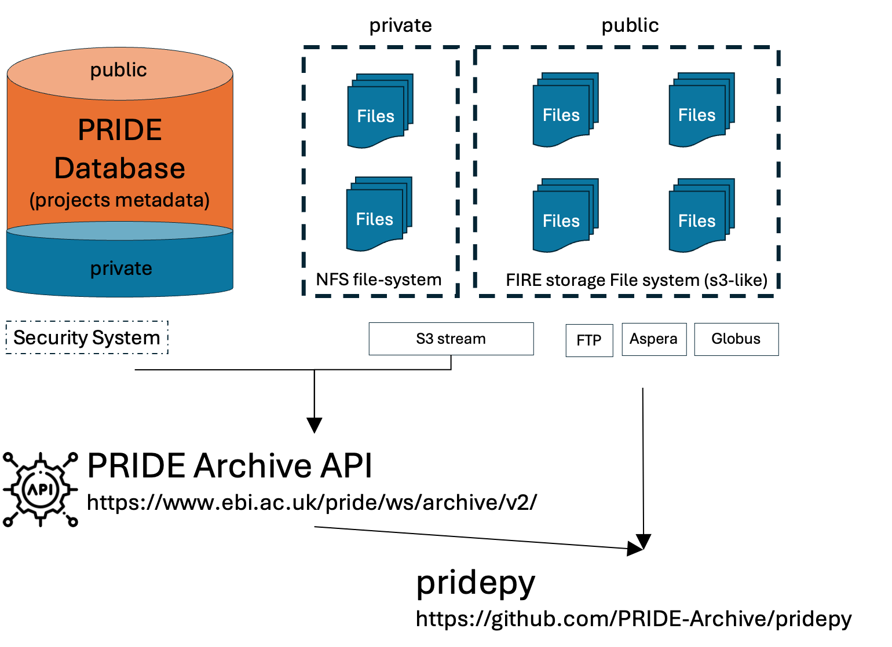

# Summary

The Proteomics Identification Database (PRIDE) [@Perez-Riverol2022-ow] is the world's largest repository for proteomics data and a founding member of ProteomeXchange [@Deutsch2023-mu]. We introduce pridepy, a Python client designed to access PRIDE Archive data, including project metadata and file downloads. pridepy offers a flexible programmatic interface for searching, retrieving, and downloading data via the PRIDE REST API. This tool simplifies the integration of PRIDE datasets into bioinformatics pipelines, making it easier for researchers to handle large datasets programmatically.

# Statement of Need

The PRIDE Archive storages an extensive collection of proteomics data [@Perez-Riverol2022-ow], but manually accessing this data can be inefficient and time-consuming. With the growing need for cloud-based [@Dai2024-yc] and HPC bioinformatics tools [@Mehta2023-og], command-line utilities that seamlessly interact with the PRIDE API are increasingly important. `pridepy` addresses this by enabling researchers to programmatically access PRIDE using Python, a widely adopted language. It allows efficient dataset integration into automated workflows, with support for large-scale data transfers via [Aspera](https://www.ibm.com/products/aspera), [Globus](https://www.globus.org/data-transfer), FTP, and HTTPS, making it ideal for scalable, reproducible pipelines.

# Methods

`pridepy` is built in Python and interacts with the [PRIDE Archive REST API](https://www.ebi.ac.uk/pride/ws/archive/v2/swagger-ui.html). The library and package not only provide data models for eanc data structure of the API but also a set of commandline to facilitate their use by users. The main features of `pridepy` include:

- The main use case and functionality of pridepy is file downloading from PRIDE Archive (**Figure 1**). PRIDE archive stores the data in a S3-like storage system, called FIRE [@Thakur2024-zu] which also includes other major EMBL-EBI archives such as ENA (European Nucleotide Archive) and EGA (European Genome-phenome Archive). FIRE data is accessible via multiple protocols including FTP, Aspera, S3 and Globus. The pridepy client provides a simple command line interface to download files from PRIDE Archive using these protocols. Each protocol offers different advantages:
  - FTP: Widely supported and easy to use
  - Aspera: High-speed file transfers, especially for large files or over long distances
  - S3 streaming: Easy to download private datasets and stream small files
  - Globus: Reliable transfers for very large datasets. 

For private datasets, only S3 streaming is supported and users need to provide submitter or reviewer credentials to access the data.

The client is available on [PyPI](https://pypi.org/project/pridepy/) and can be installed using `pip`. The source code is hosted on [GitHub](https://github.com/bigbio/pridepy) and is open-source under the Apache 2.0 license. In addition, a conda recipe is available for easy installation in conda environments. The package is continuously tested using GitHub Actions and has been successfully deployed on the EMBL-EBI HPC cluster. 

{ width=80% }

# Downloading files from PRIDE Archive

Users can download files from PRIDE Archive using the following command options: `download-all-raw-files` and `download-files-by-name`. The `download-all-raw-files` command downloads all raw files from a dataset, while the `download-files-by-name` command downloads a single file by name. Users can specify the output directory, protocol (FTP, Aspera, S3, or Globus), and other options to customize the download process. pridepy implements robust error handling and retry mechanisms to ensure successful downloads, especially for large datasets or unstable network connections. One example of downloading all raw files using Aspera from a dataset is shown below:

```bash
$ pridepy download-all-raw-files \
  -a PXD012353 \
  -o /Users/yourname/Downloads/foldername/ \
  -p aspera
```

This makes the client suitable for handling large-scale proteomics data in automated workflows, particularly in environments requiring bulk downloads of proteomics datasets.

# Discussion and Future Directions

`pridepy` successfully simplifies access to the PRIDE Archive data, but future development could focus on improving the handling of large downloads by implementing parallel downloads. Additionally, we will expand the user documentation and examples could help broaden its use within the scientific community; and at the same time produce a group of benchmarks to evaluate the performance of the client in different scenarios. We plat to continue extending the library to support more features of the PRIDE Archive API, such as dataset metadata streaming, and submission of new datasets to the PRIDE Archive.

# Acknowledgments

We would like to thank the PRIDE Archive team and contributors to this project for their invaluable input and feedback. The work is supported by core funding from the European Molecular Biology Laboratory (EMBL) and the Wellcome Trust [grant numbers 208391/Z/17/Z and 223745/Z/21/Z], and the BBSRC grant ‘DIA-Exchange’ [BB/X001911/1]. 

# References