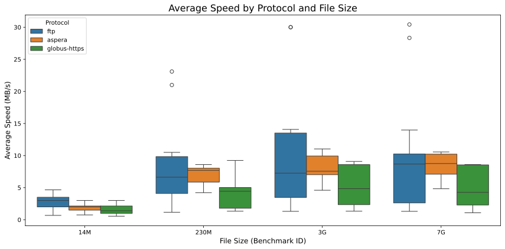
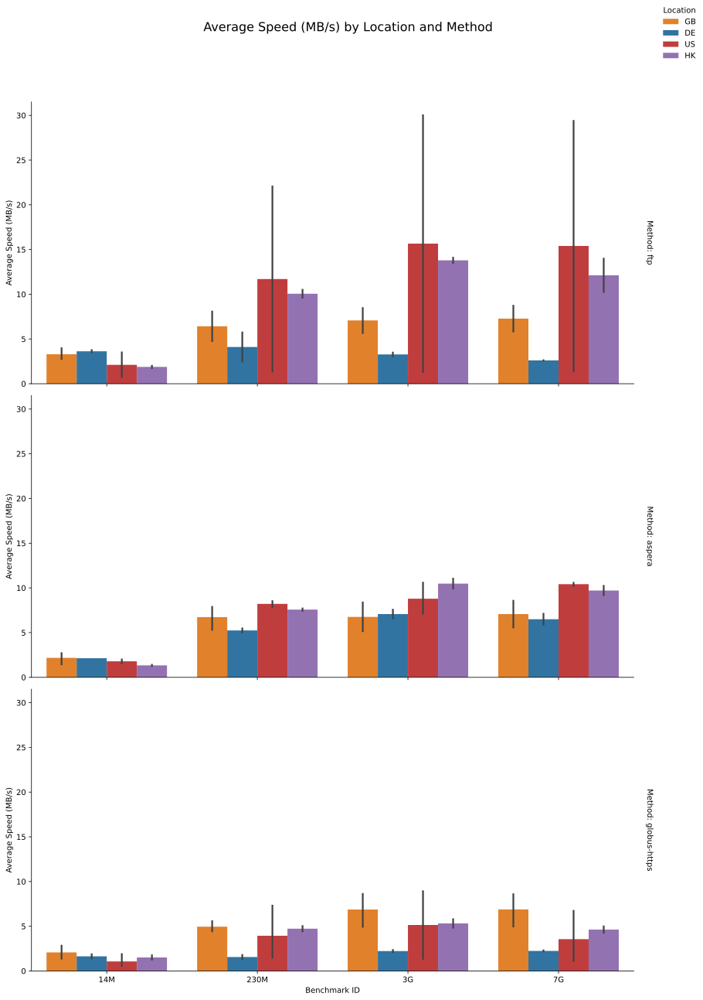

# Summary

The Proteomics Identification Database (PRIDE) [@Perez-Riverol2025-mo] is the world's largest repository for proteomics data and a founding member of ProteomeXchange [@Deutsch2023-mu]. Here, we introduce [`pridepy`](https://github.com/PRIDE-Archive/pridepy), a Python client designed to access PRIDE Archive data, including project metadata and file downloads. `pridepy` offers a flexible programmatic interface for searching, retrieving, and downloading data via the PRIDE REST API. This tool simplifies the integration of PRIDE datasets into bioinformatics pipelines, making it easier for researchers to handle large datasets programmatically.

# Statement of Need

The PRIDE Archive hosts an extensive collection of proteomics data [@Perez-Riverol2025-mo], but manual access to this data can be inefficient and time-consuming. With the increasing demand for cloud-based [@Dai2024-yc] and HPC bioinformatics tools [@Mehta2023-og], command-line utilities that integrate seamlessly with the PRIDE API are becoming essential. pridepy addresses this need by enabling researchers to programmatically access PRIDE using Python, a widely adopted programming language. It facilitates efficient integration of datasets into automated workflows and supports large-scale data transfers via [Aspera](https://www.ibm.com/products/aspera), [Globus](https://www.globus.org/data-transfer), FTP, and HTTPS, making it ideal for scalable and reproducible pipelines. Unlike other tools such as ppx [@Fondrie2021-xk], which primarily support data downloads from ProteomeXchange databases using the HTTP protocol, pridepy provides advanced functionality by leveraging multiple protocols and the latest PRIDE API to access both public and private datasets.

# Methods

`pridepy` is built in Python and interacts with the [PRIDE Archive REST API](https://www.ebi.ac.uk/pride/ws/archive/v3/webjars/swagger-ui/index.html). The library and package not only provide data models for each data structure of the API but also a set of commandline to facilitate their use by users. The main features of `pridepy` is dataset search and file download. 

The client is available on [PyPI](https://pypi.org/project/pridepy/) and can be installed using `pip`. The source code is hosted on [GitHub](https://github.com/bigbio/pridepy) and is open-source under the Apache 2.0 license. In addition, a conda recipe is available for easy installation in conda environments. The package is continuously tested using GitHub Actions and has been successfully deployed on the EMBL-EBI HPC cluster. 

### Downloading files from PRIDE Archive

By 2024, PRIDE Archive stores the data in two different storage systems (**Figure 1**), one for public data and another for private data. The public data is stored in a S3-like storage system, called FIRE [@Thakur2024-zu], which also includes other major EMBL-EBI archives such as ENA (European Nucleotide Archive) and EGA (European Genome-phenome Archive). FIRE has limited capabilities for data updates and deletions, making it ideal for long-term data storage. FIRE data is accessible via multiple protocols including FTP, Aspera and Globus. In contrast, private datasets are stored in a different file-system based on NFS, which is more flexible for data updates and deletion; but it is only accessible via PRIDE streaming protocol.

The `pridepy` client provides a simple command line interface to download files from PRIDE Archive using the following protocols. Each protocol offers different advantages:
  - **FTP**: Widely supported and easy to use
  - **Aspera**: High-speed file transfers, especially for large files or over long distances
  - **Globus**: Reliable transfers for very large datasets. It is important to notice that in the current implementation, pridepy uses the https endpoint of the Globus service, which means that the data is in fact transfer using the https protocol.

These are currently the only supported protocols for file downloads.

{ width=80% }

Users can download files from PRIDE Archive using the following command options:
- `download-all-public-raw-files`: command downloads all raw files from a dataset, it is useful for large-scale data retrieval and public datasets. 
- `download-file-by-name`: command downloads a single file by name. Users can specify the output directory, protocol (FTP, Aspera or Globus), and other options to customize the download process. For private datasets, the user and password are required to access the data.

One example of downloading all raw files using Aspera from a dataset is shown below:

```bash
$ pridepy download-all-raw-files \
  -a PXD012353 \
  -o /Users/yourname/Downloads/foldername/ \
  -p aspera
```

This makes the client suitable for handling large-scale proteomics data in automated workflows, particularly in environments requiring bulk downloads of proteomics datasets.

## Benchmark of the download speed

We conducted a benchmark to compare the download speeds of the three protocols supported by the PRIDE Archive. The test was carried out on files of varying sizes (~14MB, ~230MB, ~3GB, and ~7GB). We reached out to several PRIDE users, providing them with a benchmark script (available at https://github.com/PRIDE-Archive/pridepy/tree/master/benchmark), and the benchmark was run across multiple locations, including the USA, UK, Europe, and Asia (Hong Kong). The results are presented in Figure 2-3. 

{ width=80% }

For small files (~14MB), the three have similar performance. For medium (~230MB) and large files (~3G and ~7G), FTP can perform better than Aspera and Globus (https), but the standard deviation is higher, which means that for some file downloads it performs poorly (Figure 2). Aspera, is the most stable protocol (the lowest standard deviation) for all file sizes; for example; on big files (~7G), the median transfer speed is similar to Aspera (~ 10MB/s), but it can perform for some files and locations under 5 MB/s. In Figure 3 we present the download speed for different file sizes, protocols and locations. Aspera and Globus (https) performs similar in all locations, but FTP show a higher variability across locations and file sizes. For example, in US and Hong Kong, the download speed is higher than in Europe and UK, but the standard deviation is higher (**Figure 2-3**).

{ width=80% }


# Discussion and Future Directions

`pridepy` (https://github.com/PRIDE-Archive/pridepy) successfully simplifies access to the PRIDE Archive data, but future development could focus on improving the handling of large downloads by implementing parallel downloads. Additionally, we will expand the user documentation and examples could help broaden its use within the scientific community; and at the same time produce a group of benchmarks to evaluate the performance of the client in different scenarios. We are working to implement downloads using Globus protocol using the Globus client and not the https of the EBI Globus collection. We plan to continue extending the library to support more features of the PRIDE Archive API, such as dataset metadata streaming, and submission of new datasets to the PRIDE Archive.

# Acknowledgments

We would like to thank the PRIDE Archive team and contributors to this project for their invaluable input and feedback. The work is supported by core funding from the European Molecular Biology Laboratory (EMBL) and the Wellcome Trust [grant numbers 208391/Z/17/Z and 223745/Z/21/Z], and the BBSRC grant ‘DIA-Exchange’ [BB/X001911/1] and ‘3D-Proteomics’ [BB/V018779/1]. Thanks to Enrique Audain, Jonas Scheid, J. Sebastian Paez, and Dai Chengxin for their contributions to the benchmarking study.

# References